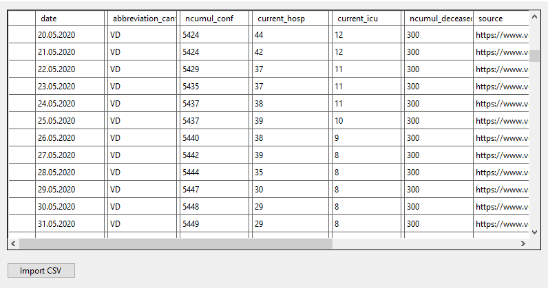
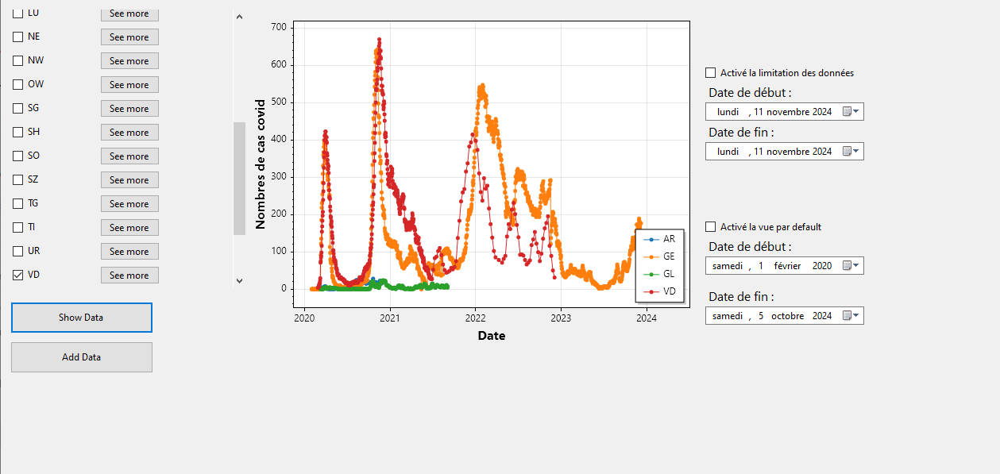
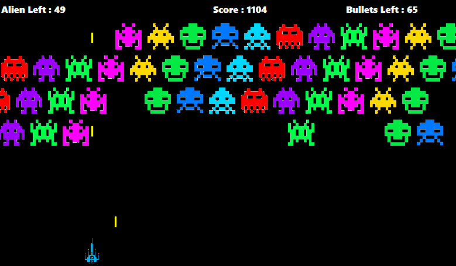
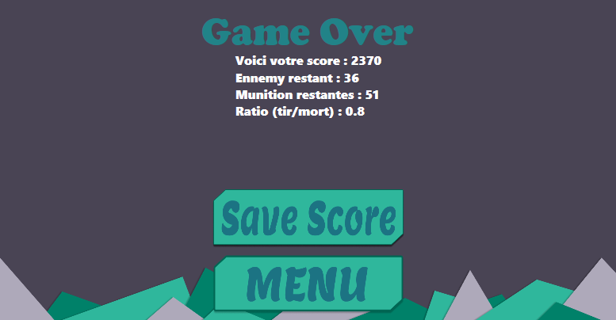
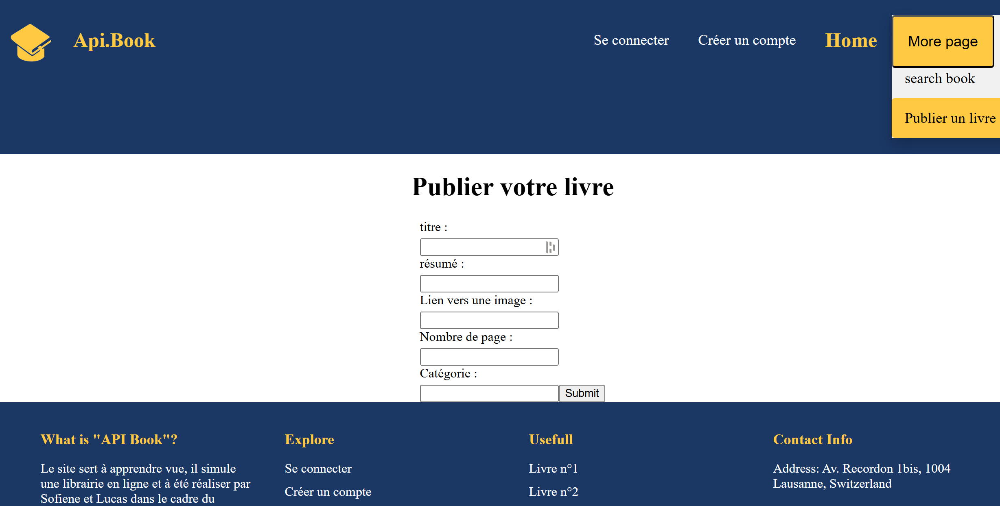
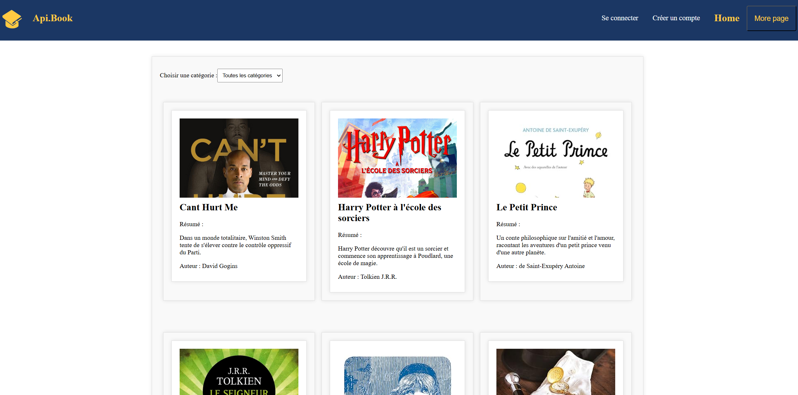
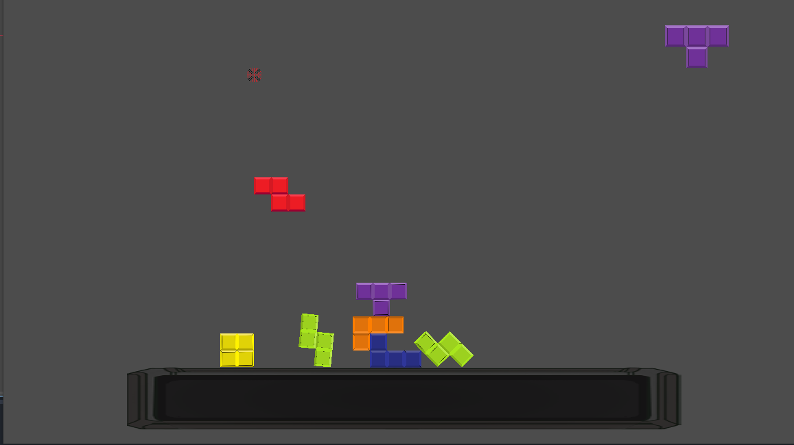
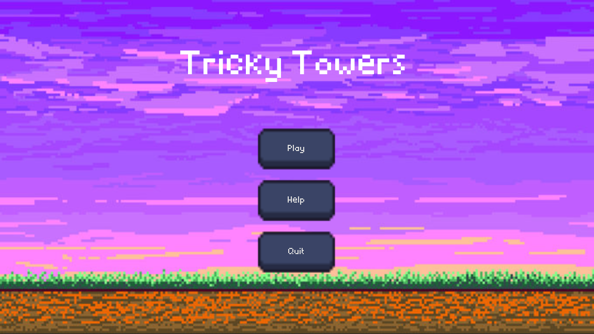

# Hi there 👋😁

Welcome to my GitHub! Here are some of my projects:

## Project 1: PFunData & Graph Visualization
**Technology:** C#,   ScottPlot
**Description:** This project focuses on data processing and graph generation using ScottPlot.

  
  

## Project 2: Space Invader Game
**Technology:**  C#  
**Description:** A classic arcade-style game recreated using Windows Forms. The game features hight score system (connection to a DB).

  
  

## Project 3: Book Management System
**Technology:** Vue.JS, JavaScript, Html, Css
**Description:** A web application for managing book data. It supports searching, adding,user authentication, and publishing new books based on a rest API.

  
  

## Project 4: Tower Party Game
**Technology:** Godot, GDScript  
**Description:** A party game where players stack towers and compete to achieve the highest stable structure. The game is directly inspire on tricky tower.

  
  

<!--
**LucasLordon/LucasLordon** is a ✨ _special_ ✨ repository because its `README.md` (this file) appears on your GitHub profile.

Here are some ideas to get you started:

- 🔭 I’m currently working on ...
- 🌱 I’m currently learning ...
- 👯 I’m looking to collaborate on ...
- 🤔 I’m looking for help with ...
- 💬 Ask me about ...
- 📫 How to reach me: ...
- 😄 Pronouns: ...
- ⚡ Fun fact: haha
-->
